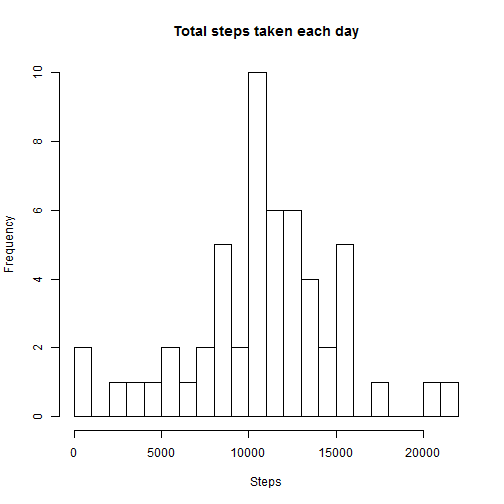
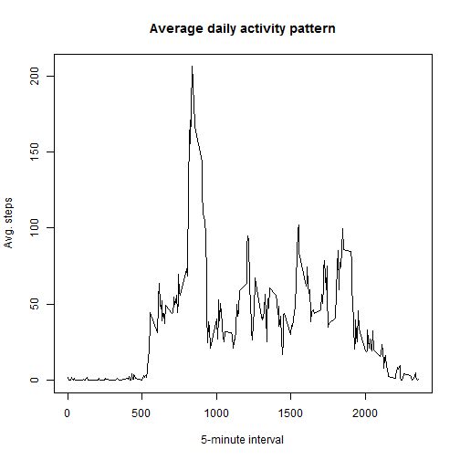
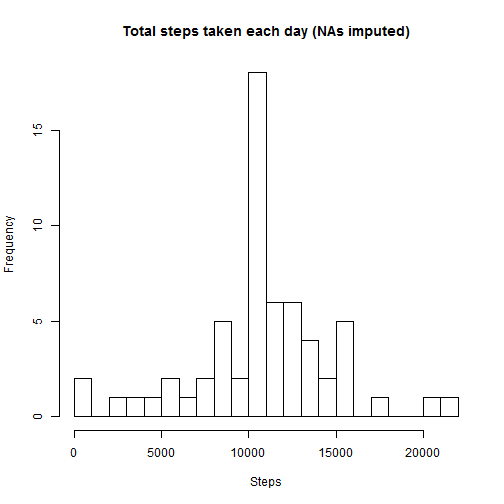
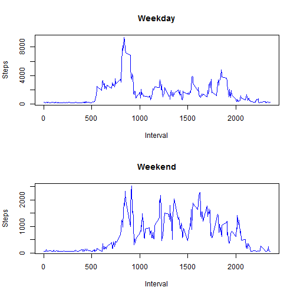

# Reproducible Research: Peer Assessment 1


## Loading and preprocessing the data

```r
data = read.csv(unz("activity.zip", "activity.csv"), header = TRUE, sep = ",", 
    stringsAsFactors = FALSE)
data$date <- as.Date(data$date)
```

Show some data to check loading was ok:

```r
nrow(data)
```

```
## [1] 17568
```

```r
head(data)
```

```
##   steps       date interval
## 1    NA 2012-10-01        0
## 2    NA 2012-10-01        5
## 3    NA 2012-10-01       10
## 4    NA 2012-10-01       15
## 5    NA 2012-10-01       20
## 6    NA 2012-10-01       25
```

```r
summary(data)
```

```
##      steps            date               interval   
##  Min.   :  0.0   Min.   :2012-10-01   Min.   :   0  
##  1st Qu.:  0.0   1st Qu.:2012-10-16   1st Qu.: 589  
##  Median :  0.0   Median :2012-10-31   Median :1178  
##  Mean   : 37.4   Mean   :2012-10-31   Mean   :1178  
##  3rd Qu.: 12.0   3rd Qu.:2012-11-15   3rd Qu.:1766  
##  Max.   :806.0   Max.   :2012-11-30   Max.   :2355  
##  NA's   :2304
```


## What is mean total number of steps taken per day?

### 1. Make a histogram of the total number of steps taken each day


```r
steps_day <- aggregate(data$steps, list(data = data$date), sum)$x
hist(steps_day, breaks = 20, main = "Total steps taken each day", xlab = "Steps")
```

 


### 2. Calculate and report the mean and median total number of steps taken per day


```r
mean_day <- mean(steps_day, na.rm = TRUE)
mean_day
```

```
## [1] 10766
```


```r
median_day <- median(steps_day, na.rm = TRUE)
median_day
```

```
## [1] 10765
```


#### Mean: 1.0766 &times; 10<sup>4</sup>
#### Median: 10765

## What is the average daily activity pattern?

1. Make a time series plot (i.e. type = "l") of the 5-minute interval (x-axis) and the average number of steps taken, averaged across all days (y-axis)


```r
steps_interval <- aggregate(. ~ interval, data = data, mean)

plot(x = steps_interval$interval, y = steps_interval$steps, type = "l", main = "Average daily activity pattern", 
    xlab = "5-minute interval", ylab = "Avg. steps")
```

 


2. Which 5-minute interval, on average across all the days in the dataset, contains the maximum number of steps?


```r
maxInterval <- steps_interval[which.max(steps_interval$steps), c("interval", 
    "steps")]
maxInterval
```

```
##     interval steps
## 104      835 206.2
```

#### Interval 835 with 206.1698 avg. steps

## Imputing missing values

### 1. Calculate and report the total number of missing values in the dataset (i.e. the total number of rows with NAs)

```r
numNAs <- sum(is.na(data))
numNAs
```

```
## [1] 2304
```

#### The total number of rows with NAs is 2304

### 2.Devise a strategy for filling in all of the missing values in the dataset. The strategy does not need to be sophisticated. For example, you could use the mean/median for that day, or the mean for that 5-minute interval, etc.

Strategy: Replace NA for the mean of the day and if there is no data, then use global mean.

### 3.Create a new dataset that is equal to the original dataset but with the missing data filled in.


```r
global_mean <- mean(data$steps, na.rm = TRUE)
data_filled <- data.frame(data)
for (date in unique(data$date)) {
    daily_mean <- mean(data$steps[data$date == date], na.rm = TRUE)
    if (is.nan(daily_mean)) {
        new_val <- global_mean
    } else {
        new_val <- daily_mean
    }
    data_filled$steps[data_filled$date == date & is.na(data_filled$steps)] <- new_val
}
```


```r
numNAs <- sum(is.na(data_filled))
numNAs
```

```
## [1] 0
```

#### The total number of rows with NAs is 0


### 4.Make a histogram of the total number of steps taken each day and Calculate and report the mean and median total number of steps taken per day. Do these values differ from the estimates from the first part of the assignment? What is the impact of imputing missing data on the estimates of the total daily number of steps?


```r
steps_day <- aggregate(data_filled$steps, list(data = data_filled$date), sum)$x
hist(steps_day, breaks = 20, main = "Total steps taken each day (NAs imputed)", 
    xlab = "Steps")
```

 


```r
mean_day <- mean(steps_day, na.rm = TRUE)
mean_day
```

```
## [1] 10766
```


```r
median_day <- median(steps_day, na.rm = TRUE)
median_day
```

```
## [1] 10766
```


#### Mean: 1.0766 &times; 10<sup>4</sup>
#### Median: 1.0766 &times; 10<sup>4</sup>

#### Now, both mean and median are the same. Also we notice in the new histogram mainly much more frequency around 10000 steps.


## Are there differences in activity patterns between weekdays and weekends?

### 1. Create a new factor variable in the dataset with two levels - "weekday" and "weekend" indicating whether a given date is a weekday or weekend day.


```r
Sys.setlocale("LC_TIME", "English")  # ensure correct day names (my computer is not in English)
```

```
## [1] "English_United States.1252"
```

```r
data_filled$day_type <- sapply(data_filled$date, function(x) ifelse(weekdays(x) %in% 
    c("Sunday", "Saturday"), "weekend", "weekday"))
```


### 2. Make a panel plot containing a time series plot (i.e. type = "l") of the 5-minute interval (x-axis) and the average number of steps taken, averaged across all weekday days or weekend days (y-axis).


```r
par(mfrow = c(2, 1))

data_weekday <- data_filled[data_filled$day_type == "weekday", ]
data_weekday_steps <- aggregate(data_weekday$steps ~ data_weekday$interval, 
    data = data_weekday, sum)
plot(data_weekday_steps, type = "l", main = "Weekday", ylab = "Steps", xlab = "Interval", 
    col = "blue")

data_weekend <- data_filled[data_filled$day_type == "weekend", ]
data_weekend_steps <- aggregate(data_weekend$steps ~ data_weekend$interval, 
    data = data_weekend, sum)
plot(data_weekend_steps, type = "l", main = "Weekend", ylab = "Steps", xlab = "Interval", 
    col = "blue")
```

 

